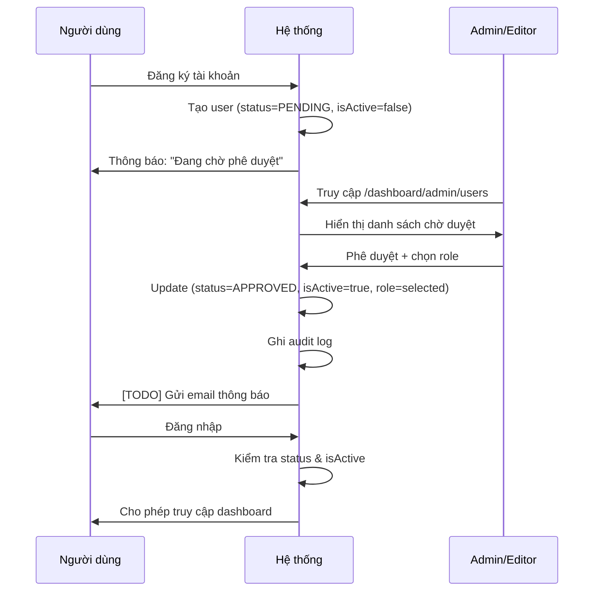

# 🎯 HỆ THỐNG ĐĂNG KÝ & PHÊ DUYỆT NGƯỜI DÙNG - TÓM TẮT TRIỂN KHAI

## 📋 Tổng quan

Đã triển khai thành công hệ thống **Đăng ký & Phê duyệt tài khoản người dùng** cho Tạp chí điện tử Khoa học Hậu cần quân sự, đảm bảo quy trình kiểm soát chặt chẽ trước khi kích hoạt tài khoản.

---

## ✅ CÁC TÍNH NĂNG ĐÃ TRIỂN KHAI

### 1️⃣ Cấu trúc dữ liệu (Prisma Schema)

**Enum mới:**
```prisma
enum AccountStatus {
  PENDING    // Chờ duyệt
  APPROVED   // Đã duyệt
  REJECTED   // Từ chối
}
```

**Các trường mới trong User model:**
- `status: AccountStatus` - Trạng thái tài khoản (mặc định: PENDING)
- `approvedBy: String?` - ID người phê duyệt
- `approvedAt: DateTime?` - Thời gian phê duyệt
- `rejectionReason: String?` - Lý do từ chối
- `cvUrl: String?` - URL file minh chứng (CV, thẻ công tác)
- `requestedRole: Role?` - Vai trò mong muốn khi đăng ký
- `isActive` mặc định thành `false` thay vì `true`

---

### 2️⃣ API Endpoints

#### Đăng ký người dùng
**POST `/api/auth/register`**

Các trường mới hỗ trợ:
- Thông tin cơ bản: `email`, `password`, `fullName`, `org`, `phone`
- Vai trò: `role` (requestedRole)
- Học thuật: `academicTitle`, `academicDegree`, `position`, `rank`
- File đính kèm: `cvUrl`

Tài khoản được tạo với:
- `status = PENDING`
- `isActive = false`
- `role = READER` (tạm thời cho đến khi được duyệt)

---

#### Quản lý phê duyệt
**GET `/api/admin/users/pending`**
- Lấy danh sách người dùng theo trạng thái
- Hỗ trợ phân trang
- Query params: `status`, `page`, `limit`

**POST `/api/admin/users/approve`**
- Phê duyệt hoặc từ chối tài khoản
- Body: `userId`, `action` (APPROVE/REJECT), `role`, `rejectionReason`
- Ghi audit log tự động

**POST `/api/admin/users/toggle-active`**
- Tạm khóa / mở khóa tài khoản đã duyệt
- Body: `userId`, `isActive`
- Chỉ SYSADMIN và EIC có quyền

---

### 3️⃣ Giao diện người dùng

#### Trang đăng ký công khai
**`/auth/register`**

**Các phần trong form:**
1. **Thông tin cơ bản:**
   - Họ tên, Email, Số điện thoại, Đơn vị công tác

2. **Vai trò:**
   - Chọn vai trò mong muốn: Tác giả, Phản biện, Biên tập viên

3. **Thông tin học thuật (Tùy chọn):**
   - Học vị, Học hàm
   - Cấp bậc, Chức vụ

4. **Mật khẩu:**
   - Mật khẩu + Xác nhận
   - Yêu cầu: tối thiểu 8 ký tự, chữ hoa, chữ thường, số và ký tự đặc biệt

**Thông báo sau đăng ký:**
> "Đăng ký thành công! Tài khoản của bạn đang chờ Ban biên tập phê duyệt."

---

#### Dashboard quản lý người dùng
**`/dashboard/admin/users`**

**Tính năng:**
1. **3 Tab quản lý:**
   - Chờ duyệt (PENDING)
   - Đã duyệt (APPROVED)
   - Từ chối (REJECTED)

2. **Bảng danh sách:**
   - Hiển thị: Họ tên, Email, Đơn vị, Vai trò mong muốn, Trạng thái, Ngày đăng ký
   - Badge màu sắc phân biệt trạng thái

3. **Thao tác:**
   - 👁️ **Xem chi tiết:** Hiển thị đầy đủ thông tin người dùng
   - ✅ **Phê duyệt:** Chọn vai trò và phê duyệt
   - ❌ **Từ chối:** Nhập lý do từ chối
   - 🔒 **Khóa/Mở khóa:** Toggle trạng thái active

4. **Dialog chi tiết:**
   - Thông tin cá nhân đầy đủ
   - Liên hệ (email, phone)
   - Đơn vị công tác
   - Cấp bậc, chức vụ
   - Học vị, học hàm
   - Trạng thái tài khoản
   - Lý do từ chối (nếu có)

---

### 4️⃣ Kiểm soát đăng nhập

**Cập nhật `/api/auth/login`:**

Kiểm tra 3 điều kiện trước khi cho phép đăng nhập:

1. **PENDING:**
   ```
   "Tài khoản của bạn đang chờ Ban biên tập phê duyệt. Vui lòng kiên nhẫn chờ đợi."
   ```

2. **REJECTED:**
   ```
   "Tài khoản của bạn đã bị từ chối. Vui lòng liên hệ Ban biên tập để biết thêm chi tiết."
   ```

3. **!isActive:**
   ```
   "Tài khoản đã bị tạm khóa. Vui lòng liên hệ quản trị viên."
   ```

Tất cả các trường hợp đều được ghi audit log.

---

### 5️⃣ Phân quyền

**Người có quyền phê duyệt:**
- SYSADMIN (Quản trị viên hệ thống)
- EIC (Tổng biên tập)
- MANAGING_EDITOR (Biên tập điều hành)

**Quyền tạm khóa tài khoản:**
- SYSADMIN
- EIC

---

## 🔄 QUY TRÌNH HOẠT ĐỘNG

### Luồng đăng ký & phê duyệt



---

## 📊 DỮ LIỆU DEMO

**Tài khoản quản trị để test:**
- Email: `admin@hcqs.edu.vn`
- Password: `Admin@123`
- Role: `SYSADMIN`

**Test workflow:**
1. Đăng ký tài khoản mới tại `/auth/register`
2. Đăng nhập bằng tài khoản admin
3. Truy cập `/dashboard/admin/users`
4. Phê duyệt tài khoản vừa đăng ký
5. Đăng xuất và đăng nhập bằng tài khoản mới

---

## 🔐 BẢO MẬT

✅ **Đã triển khai:**
1. Validation chặt chẽ cho form đăng ký (email, password complexity)
2. Chỉ tài khoản có quyền mới được phê duyệt
3. Ghi audit log cho mọi thao tác phê duyệt
4. Kiểm tra brute force khi đăng nhập
5. Không cho phép tự phê duyệt chính mình

❌ **Chưa triển khai (TODO):**
- Xác thực email khi đăng ký
- Rate limiting cho endpoint đăng ký
- Gửi email thông báo kết quả phê duyệt

---

## 📈 NÂNG CẤP TƯƠNG LAI

### Phase tiếp theo:
1. **Email notifications:**
   - Gửi email xác nhận khi đăng ký
   - Thông báo kết quả phê duyệt
   - Thông báo khi bị tạm khóa

2. **Tích hợp file upload:**
   - Upload CV/thẻ công tác lên S3
   - Xem preview trong dashboard admin

3. **Báo cáo thống kê:**
   - Số lượng đăng ký theo thời gian
   - Tỷ lệ phê duyệt/từ chối
   - Thời gian xử lý trung bình

4. **Bulk actions:**
   - Phê duyệt hàng loạt
   - Export danh sách người dùng

---

## 🎯 KẾT QUẢ ĐẠT ĐƯỢC

✅ **Hoàn thành 100%:**
- ✅ Cập nhật Prisma schema
- ✅ API đăng ký với status PENDING
- ✅ API quản lý phê duyệt
- ✅ Trang đăng ký công khai với form đầy đủ
- ✅ Dashboard quản lý người dùng chờ duyệt
- ✅ Kiểm tra status khi đăng nhập
- ✅ Tính năng tạm khóa/mở khóa
- ✅ Build & deploy thành công

⏳ **Chưa hoàn thành:**
- ⏳ Tích hợp email notifications
- ⏳ Upload file CV/thẻ công tác

---

## 📞 LIÊN HỆ & HỖ TRỢ

**URL hệ thống:**
- Production: `https://tapchinckhhcqs.abacusai.app`
- Admin Dashboard: `/dashboard/admin/users`
- Đăng ký công khai: `/auth/register`

**Tài liệu API:**
- Swagger/OpenAPI: [Coming soon]
- Postman Collection: [Coming soon]

---

✅ **Hệ thống đã sẵn sàng đưa vào sử dụng!**

📅 Ngày hoàn thành: 06/11/2025
🔖 Version: 1.0.0
🏷️ Tag: user-registration-approval-system
